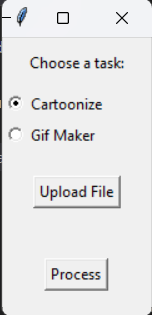

## Cartoonizer and Gif Maker

## Details

A graphical user interface application that lets users either cartoonize an image or convert a video to a GIF. 

### Prerequisites:

You need to have the following libraries installed:

1. `os`
2. `cv2`
3. `numpy`
4. `moviepy`
5. `tkinter`

To install the necessary libraries, you can use: python pip install opencv-python moviepy numpy

## Features

1. **Cartoonize Images:** Convert any regular image into a cartoonized version.
2. **Gif Maker:** Convert short video clips into GIFs.
3. **Easy to Use GUI:** An intuitive user interface that requires no coding.

---

## Getting Started

1. Clone the repository to your local machine.
2. Navigate to the directory containing the script.
3. Run the script using Python.

---

## How to Use

1. **Choose a Task:** Select either "Cartoonize" or "Gif Maker" from the GUI.
2. **Upload File:** Click on the "Upload File" button to choose the file you want to process.
3. **Process:** Click on the "Process" button to either cartoonize the image or convert the video to GIF.
4. **View Result:** After processing, a new window will pop up, displaying the path where the output has been saved.

---

## Screenshots

---

## Contributions

Feel free to fork the project, make a change, and send a pull request. Any contributions you make are greatly appreciated!

---

## License

This project is licensed under the MIT License. See the LICENSE.md file for details.

---

## Acknowledgement

Thanks to the Python and MoviePy communities for their comprehensive documentation and resources that made this project possible.